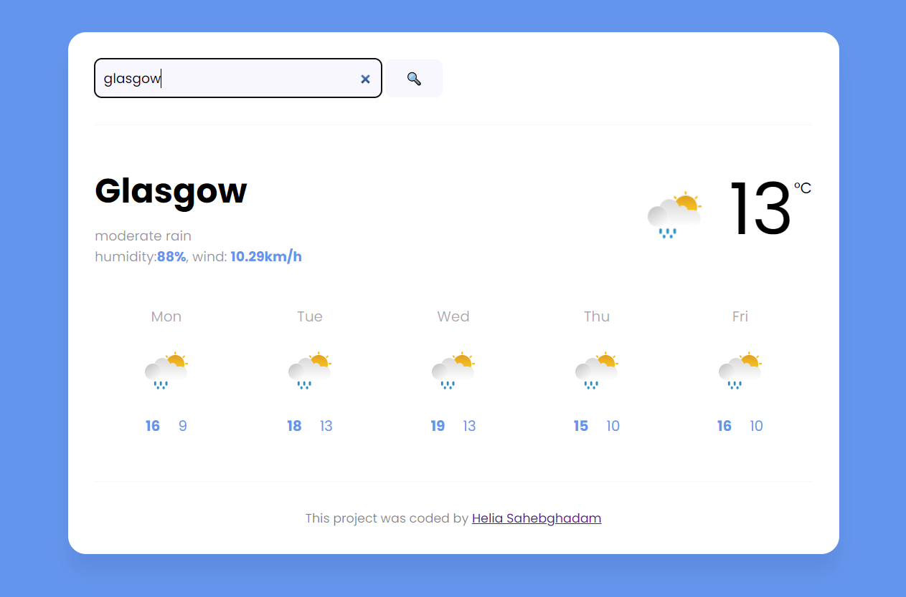
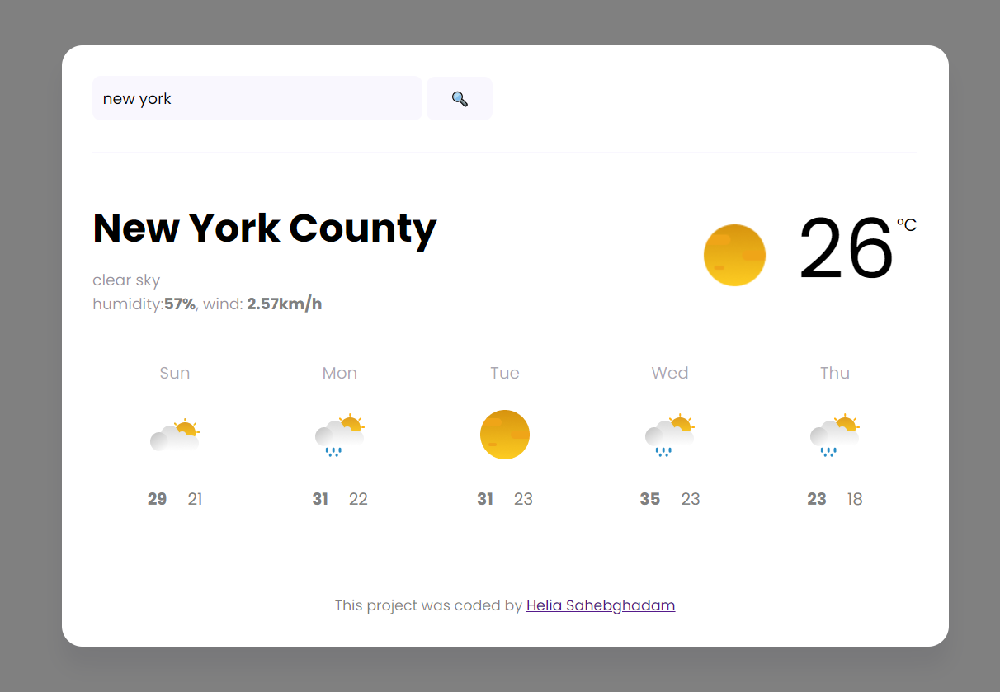

# Weather Forecast Web Application
This repository contains a simple weather application that provides real-time weather updates for any city. Built with HTML, CSS, and JavaScript, it uses API to fetch and display weather data in a minimalist interface.

# Features
- Real-Time Weather Updates: Get the latest weather data for any city around the world.
- Dynamic Backgrounds: The app's background color changes based on the weather conditions (e.g., sunny, cloudy, rainy).
- Detailed Weather Information: Displays temperature, humidity, wind speed, and weather descriptions.
- 5-Day Forecast: View the weather forecast for the next five days, including temperature ranges and weather icons.
 
# Preview

# Technologies Used
- HTML5: The backbone of the app structure.
- CSS3: For styling and responsive design, including dynamic color changes based on weather conditions.
- JavaScript (ES6+): Handles data fetching from the API and DOM manipulation.
- Axios: A promise-based HTTP client used to fetch weather data.
- SheCodes Weather API: The source of real-time weather data.

